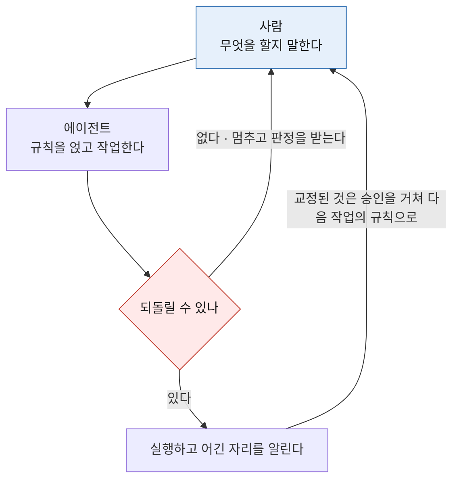
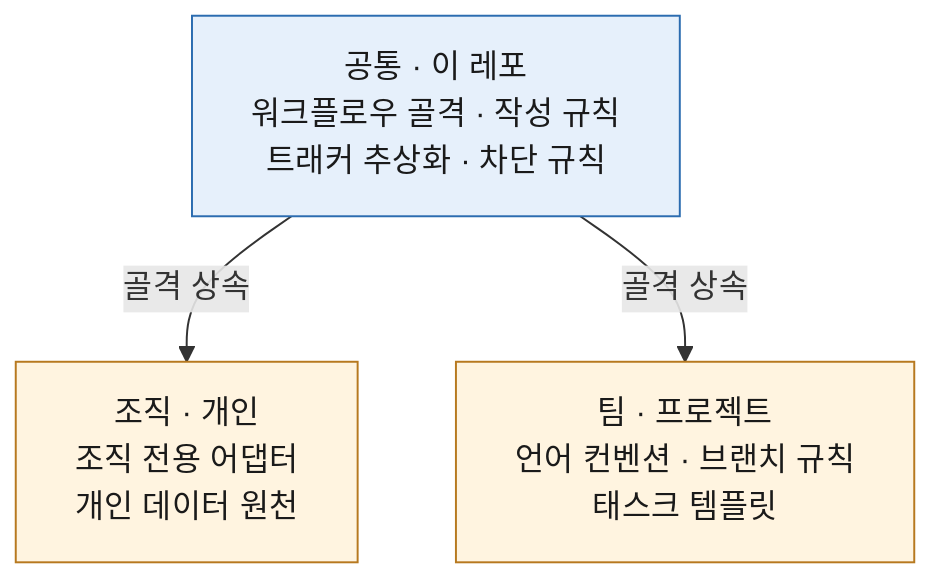
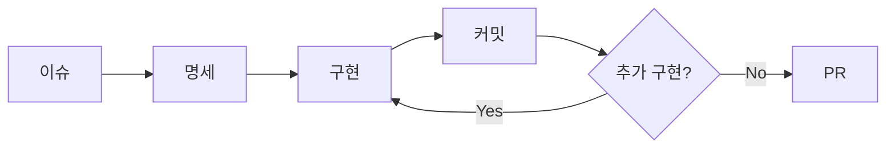

# claude-ops-agent

**개발 운영 규칙을 계층으로 나눠 배포하는 에이전트입니다.** Claude Code 플러그인으로 구현했습니다.

에이전트에게 일을 맡기는 방식을 한 벌로 고정해 두는 도구입니다. 규칙은 세션 시작에 걸리고 워크플로우는 자연어로 부릅니다. 공통 규칙은 이 레포에 두고 조직·팀 특화는 별도 플러그인에 둡니다.

세 문장으로 줄이면 이렇습니다.

- 되돌릴 수 없는 것은 **실행 전에 막습니다.** 판정 주체는 사람입니다
- 되돌릴 수 있는 것은 막지 않고 **어긴 자리를 알립니다**
- 그렇게 드러난 것은 **다음 작업이 읽도록 남깁니다**

## 한 장으로

작업 하나가 이 순환을 돕니다.



양 끝이 이어져 있는 것이 이 도구의 전부입니다. 이번 작업에서 교정된 것이 다음 작업의 규칙이 됩니다. 그 승격을 사람이 통과시킵니다.

## 멈출 자리를 미리 정해 둔다

작업 하나를 마치며 머지를 위해 세션 허용을 열었습니다. 머지 직후 같은 창이 아직 열려 있는 동안 문서 한 줄이 기본 브랜치로 바로 나갔습니다. 기본 브랜치 직접 push 를 막는 가드는 정상 동작하고 있었고 **사람이 켠 30분이 그것을 덮었습니다.** 승인한 행위는 머지였는데 통과한 행위는 다른 것이었습니다.

규칙을 더 촘촘히 깔아도 이런 순간이 오지 않게 만들 수는 없습니다. 그래서 없애는 대신 어디서 멈출지를 정해 뒀습니다.

| 대상 | 강제 수준 |
|------|-----------|
| 대외비 유출, 머지·릴리즈·force push, 기본 브랜치 직접 push, 리소스 삭제 | 실행 전 차단. 사람이 세션 허용을 켤 때까지 |
| 문장 표현, 문서 구조, 편집 후 자가 점검 | 규칙을 미리 깔고 어긴 것만 통지 |

전부 막으면 일이 멈추고 전부 권고로 두면 안 지켜집니다. 표현을 기계로 판정하면 문맥상 정상인 것까지 걸리고 자동으로 고쳐 쓰면 뜻이 틀어집니다. 그래서 표현 층은 차단하지 않습니다.

위 사건은 [#284](https://github.com/idean3885/claude-ops-agent/issues/284) 로 남겼습니다. 세션 허용이 시간으로만 열리고 승인한 행위 갈래로 좁혀지지 않는다는 것이 아직 풀지 못한 지점입니다.

## 규칙은 계층으로 나눠 배포한다

같은 규칙을 레포마다 복사해 두면 고칠 때 전부를 찾아다녀야 합니다. 그렇다고 한 벌로 합치면 조직 전용 정보가 공개 표면으로 나갑니다. 나누는 기준은 **재사용 범위와 노출 경계**입니다.



위는 누구나 받고 아래 둘은 각각 본인과 팀만 받습니다. 팀 규칙을 받으면서 개인 규칙을 남기는 형태입니다. 기본값을 상속하고 필요한 지점만 재정의하는 방식이라 설정에서 쓰는 base + overlay 와 같습니다.

## 배운 것은 사람이 승인해야 자산이 된다

작업 중 사용자가 교정한 대목을 후보로 적립하고 세션을 마치기 전에 기존 자산과 대조합니다. **자동으로 등재되는 경로는 없습니다.** 검증 없이 스스로 학습하는 루프에서 품질 하락이 보고됐고 자동 수집에 검증을 붙이지 않으면 노이즈가 자산이 됩니다.

같은 실수가 재발하면 차단 규칙을 늘리지 않고 원인을 먼저 봅니다. 가드가 늘면 가드끼리 충돌하고 오탐이 쌓이면 사람이 가드를 끕니다 → [레슨런 자산화](docs/lessons.md)

## 규칙에는 출처가 붙어 있다

근거 없는 규칙은 걸지 않습니다. 문단·목록·번역투·문서 목적 규칙에 각각 문헌 출처를 달았습니다 → [규칙의 근거](#규칙의-근거)

읽는 쪽도 나눕니다. 사람이 읽는 한국어 산문과 모델이 읽고 실행하는 문서에 같은 규칙을 걸지 않습니다. 한 파일이 양쪽 다 읽히면 그 문서가 존재하는 이유 쪽을 따릅니다.

무엇을 AI 티로 보고 무엇을 저자의 취향으로 남길지는 [ADR 0001](docs/adr/0001-ai-tell-removal-priority.md) 에서 정했습니다. 전부 지우면 글에서 사람이 사라집니다.

## 일은 이렇게 흐른다

이슈 하나가 PR 까지 가는 동안 단계를 사람이 외우지 않습니다. 자연어로 부르면 현재 상태를 보고 다음 단계를 실행합니다.



플랜·커밋·머지 세 곳에서 사람 승인을 받습니다. 여러 레포에 걸친 변경은 통일 브랜치명과 레포별 트래커 정의를 한 흐름으로 맞춥니다.

## 한계와 대가

못 갖춘 것은 못 갖췄다고 적습니다. 설치 전에 알고 있어야 하는 것들입니다.

| 항목 | 내용 |
|------|------|
| 효과 | 효율이 올랐다는 주장은 넣지 않았습니다. 측정한 적이 없습니다 |
| 지표 | 레슨런 자산화의 지표는 항목만 정의하고 값은 비워 뒀습니다 |
| 적용 범위 | 아직 1인입니다. 팀 규모에서 검증되지 않았습니다 |
| 게이트 범위 | 세션 허용은 시간으로만 열립니다. 승인한 행위 갈래로 좁히지 못합니다 ([#284](https://github.com/idean3885/claude-ops-agent/issues/284)) |
| 패턴 판정 | 표현 규칙은 정규식이라 활용형을 빠뜨리면 통과합니다 ([#285](https://github.com/idean3885/claude-ops-agent/issues/285)) |
| 차단의 성질 | 도구 경계에서 명령 문자열을 봅니다. 방어 계층이지 보안 경계가 아닙니다 |
| 훅 비용 | 도구 호출마다 훅이 붙습니다. 느린 기기에서는 지연이 보입니다 |

설계 판단의 배경과 되돌린 결정은 [docs/design-philosophy.md](docs/design-philosophy.md) 에 있습니다.

## 설치

```bash
claude plugin marketplace add https://github.com/idean3885/claude-ops-agent.git
claude plugin install ops-agent@ops-agent
```

새 세션부터 적용됩니다. 설치 확인·갱신 방법, 무엇이 자동으로 걸리고 무엇을 불러서 쓰는지는 [설치하고 쓰는 법](docs/usage.md) 에 있습니다.

## 문서

| 문서 | 무엇의 정본인가 |
|------|-----------------|
| [docs/usage.md](docs/usage.md) | 설치, 시점별 동작, 스킬·스크립트 목록 |
| [docs/design-philosophy.md](docs/design-philosophy.md) | 설계 판단과 되돌린 결정 |
| [docs/action-gate.md](docs/action-gate.md) | 차단 규칙 (대외비·구현 세부·되돌리기 어려운 행위) |
| [docs/hooks-config.md](docs/hooks-config.md) | 표현 규칙 hook 설정, 플러그인 자체 관리 |
| [docs/conventions-slot.md](docs/conventions-slot.md) | 커밋·체인지로그 표기 선언 위치와 해석 순서 |
| [docs/lessons.md](docs/lessons.md) | 레슨런 수집·자산화, 재발 분석, 지표 |
| [docs/effort-policy.md](docs/effort-policy.md) | 작업 강도, 컨텍스트 예산 |
| [docs/personal-scope.md](docs/personal-scope.md) | 개인 용도 기능 |
| [docs/adr/](docs/adr/) | 개별 결정 기록 |
| [CLAUDE.md](CLAUDE.md) | 이 레포의 작업 규칙 (에이전트가 읽는 정본) |
| [CONTRIBUTING.md](CONTRIBUTING.md) | 변경 반영 경로 |

만든 배경은 블로그에 적었습니다.

- [AI에게 코드를 맡기고 나서 달라진 일하는 방식](https://idean3885.github.io/posts/ai-changed-my-workflow/)
- [코드에서 사고로](https://idean3885.github.io/posts/from-coding-to-thinking/)

## 규칙의 근거

작성 규칙은 [`config/style-rules/`](config/style-rules/) 에 있고 규칙마다 출처를 달았습니다. 유형별 적용 대상·적용 강도·합격선은 [`extensions/profiles.md`](config/style-rules/extensions/profiles.md) 가 정본입니다.

| 규칙 | 근거 |
|------|------|
| 문단·목록·제목·코드 설명 (`base/readability.md`) | Google Developer Documentation Style Guide, Microsoft Writing Style Guide, Nielsen Norman Group 읽기 행태 연구, WCAG 1.3.1, Miller's Law |
| 번역투 판정 (`base/ai-tells.md`) | 국내 번역학 연구자들이 정리한 번역투 8유형 + Toury 1995(interference), Baker 1993(normalisation), Toral 2019(post-editese). 유형별 문헌 대응은 [references/scholarship.md](config/style-rules/references/scholarship.md) |
| AI 티 분류 골격 (A~J) | [`epoko77-ai/im-not-ai`](https://github.com/epoko77-ai/im-not-ai) (MIT) 차용. K(감정체·의인화)는 자체 확장 |
| 정량 지표 14개 | 번역학 3분류로 인코딩. 채택·구현 여부를 표에 명시. [metrics/metrics-spec.md](config/style-rules/metrics/metrics-spec.md) |
| 에이전트가 읽는 문서 (`base/authoring.md`) | [`mattpocock/skills`](https://github.com/mattpocock/skills) 의 `writing-for-agents` (MIT) 차용. 한국어·이 레포 맥락의 판정과 예시는 자체 작성 |
| 문서의 목적과 범위 (`base/purpose.md`) | Barbara Minto 「The Pyramid Principle」(질문 하나에 답하는 구조), Google Technical Writing Course(착수 전 독자·범위 정의) |
| 톤·구두점·분량 (`base/tone.md` 등) | 자체 작성 |

차용 원천의 채택 판본·항목 번호 대응·마지막 대조일은 [references/upstream.md](config/style-rules/references/upstream.md) 가 갖습니다. 번호가 같아도 규칙이 다른 쌍이 있으므로 대조 전에 그 표를 봅니다.

문헌 근거와 지표 정의는 세션 시작 미러 대상이 아닙니다. 세션 예산을 지키기 위해 추적이 필요할 때만 참조합니다.

## 라이선스

MIT. AI 티 분류는 [`epoko77-ai/im-not-ai`](https://github.com/epoko77-ai/im-not-ai)(MIT) 의 10대 분류 골격(A~J)·심각도(S1/S2/S3) 체계와 지표 정의 골격을 차용했고 처방·예시·hook 매핑은 한국어 기술 문서 맥락으로 자체 작성했습니다.
