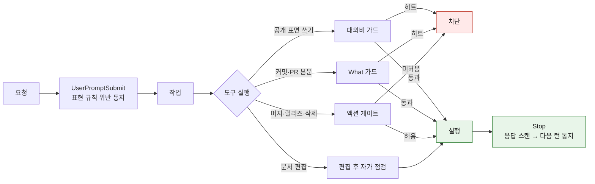
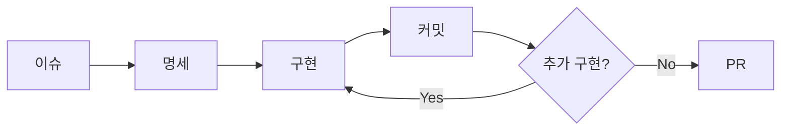
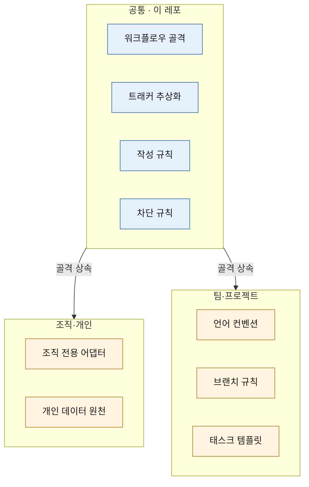

# claude-ops-agent

개발 운영 규칙을 계층으로 나눠 배포하는 에이전트입니다. Claude Code 플러그인으로 구현했습니다.

공통 규칙은 이 레포에 두고, 조직·팀 특화는 별 플러그인에 둡니다. 설치하면 규칙이 세션 시작에 자동으로 걸리고, 워크플로우는 자연어로 부릅니다.

되돌릴 수 없는 것은 실행 전에 막고, 나머지는 막지 않고 알립니다. 그리고 틀린 것은 다음 작업이 읽도록 남깁니다.

## 왜 만들었나

작업 하나를 마치며 PR 머지를 위해 액션 게이트를 열었습니다. 머지 직후, 같은 창이 아직 열려 있는 동안 문서 한 줄을 기본 브랜치에 직접 푸시했습니다. 기본 브랜치 직접 push 를 막는 가드는 정상 동작하고 있었고, **사람이 켠 30분이 그것을 덮었습니다.** 승인한 행위는 머지였는데 통과한 행위는 다른 것이었습니다.

에이전트에게 일을 맡기면 이런 순간이 옵니다. 규칙을 더 촘촘히 깔아도 오지 않게 만들 수는 없습니다. 그래서 이 레포가 하는 일은 셋입니다.

- 되돌릴 수 없는 행위는 **실행 전에 막습니다.** 판정 주체는 사람입니다
- 되돌릴 수 있는 것은 막지 않고 **어긴 자리를 알립니다.** 문장 표현이 여기 해당합니다
- 그렇게 드러난 것을 **다음 작업이 읽게 남깁니다.** 위 사건은 [#284](https://github.com/idean3885/claude-ops-agent/issues/284) 로 남았습니다

## 무엇이 다른가

### 세 가지를 한 벌로 갖습니다

규칙을 여러 도구에 배포하는 것, 되돌리기 어려운 명령을 막는 것, 작업에서 배운 것을 다음 작업에 남기는 것입니다. 셋 다 각각 하는 도구가 이미 있고, 이 레포는 그 셋이 한 흐름으로 이어진 자리에 있습니다.

이어져야 하는 이유는 위 사건이 보여 줍니다. 차단만 있으면 열린 창을 아무도 되짚지 않고, 통지만 있으면 되돌릴 수 없는 것이 지나가고, 남기지 않으면 같은 판단이 다음 작업에서 반복됩니다.

### 되돌릴 수 없는 것만 막고, 나머지는 알립니다

전부 막으면 일이 멈추고, 전부 권고로 두면 안 지켜집니다. 그래서 강제 수준을 둘로 나눠 뒀습니다.

| 대상 | 강제 수준 |
|------|-----------|
| 대외비 유출, 머지·릴리즈·force push, 기본 브랜치 직접 push, 리소스 삭제 | 실행 전 차단. 사람이 세션 허용을 켤 때까지 |
| 문장 표현, 문서 구조, 편집 후 자가 점검 | 규칙을 미리 깔고 어긴 것만 통지 |

표현을 기계로 판정하면 문맥상 정상인 것까지 걸리고, 자동으로 고쳐 쓰면 뜻이 틀어집니다. 그래서 표현 층은 차단하지 않습니다. 차단 대상과 통과 절차는 [docs/action-gate.md](docs/action-gate.md) 에 있습니다.

### 규칙마다 출처가 달려 있고, 읽는 쪽에 따라 나뉩니다

근거 없는 규칙은 걸지 않습니다. 문단·목록·번역투·문서 목적 규칙에 각각 문헌 출처를 달았습니다 → [규칙의 근거](#규칙의-근거)

읽는 쪽도 나눕니다. 사람이 읽는 한국어 산문과 모델이 읽고 실행하는 문서에 같은 규칙을 걸지 않습니다. `SKILL.md`·`CLAUDE.md`·가이드를 고치면 에이전트용 규칙(`AU1~AU6`)이 함께 걸립니다. 한 파일이 양쪽 다 읽히면 그 문서가 존재하는 이유 쪽을 따릅니다.

### 배운 것은 사람이 승인해야 자산이 됩니다

턴마다 훅이 사용자 교정을 레슨런 후보로 적립하고, 세션을 마치기 전에 `/learn` 이 세션 전체를 기존 자산과 대조합니다. **자동으로 등재되는 경로는 없습니다.** 검증 없이 스스로 학습하는 루프에서 품질 하락이 보고됐고, 자동 캡처에 검증을 붙이지 않으면 노이즈가 자산이 됩니다.

재발하면 차단 규칙을 늘리지 않고 원인을 분석합니다. 가드가 늘면 가드끼리 충돌하고, 오탐이 쌓이면 사람이 가드를 끕니다 → [레슨런 자산화](docs/lessons.md)

## 빠른 시작

```bash
claude plugin marketplace add https://github.com/idean3885/claude-ops-agent.git
claude plugin install ops-agent@ops-agent
```

- 마켓플레이스 이름은 레포명이 아니라 `.claude-plugin/marketplace.json` 의 `name` 인 `ops-agent` 입니다
- 세션 시작에 로드되므로 설치 후 새 세션부터 적용됩니다
- 스킬을 직접 호출하지 않아도 됩니다. 자연어로 요청하면 트리거 키워드로 라우팅됩니다

걸렸는지 확인하는 방법입니다.

1. `claude plugin list` 에 `ops-agent@ops-agent` 가 enabled 로 나오는지 확인
2. 세션 시작 메시지에 provider 와 git identity 가 표시되는지 확인
3. "이슈 만들어줘" 라고 하면 `Skill(ops-agent:flow)` 호출이 표시되는지 확인

규칙을 고쳤을 때는 버전을 올려야 반영됩니다. 설치는 버전 단위 스냅샷으로 캐시되므로 파일만 고치면 받는 쪽에 전달되지 않습니다.

```bash
claude plugin marketplace update ops-agent
claude plugin update ops-agent@ops-agent
```

## 설치하면 걸리는 것

호출하지 않아도 동작합니다.

| 시점 | 동작 | 강제 수준 |
|------|------|-----------|
| SessionStart | provider 감지 (git remote host → 트래커 정의) | 자동 적용 |
| SessionStart | git identity 를 provider 기준으로 설정 | 자동 적용 |
| SessionStart | 작성 규칙을 `~/.claude/ops-agent/style-rules/` 로 미러 | 자동 적용 |
| SessionStart | 표현 규칙 목록 주입 (세션 1회) | 자동 적용 |
| PreToolUse | 대외비 키워드가 공개 표면으로 나가는 명령 | **실행 전 차단** |
| PreToolUse | 커밋·PR·이슈 본문의 구현 세부 서술 | **실행 전 차단** |
| PreToolUse | 머지·릴리즈·force push·클러스터 변경·리소스 삭제 | **사용자가 세션 허용을 켤 때까지 차단** |
| PreToolUse | 기본 브랜치 직접 push, `reset --hard`·`clean -f`·`branch -D`·`restore` | **사용자가 세션 허용을 켤 때까지 차단** |
| PostToolUse | 문서 편집 후 표현·구조 위반 위치와 수치 | 알림 (마커 파일 있을 때만) |
| PostToolUse | 스킬·지침·provider 문서 편집 시 `authoring`(AU1~AU6) 자가 점검 지시 | 알림 (경로로 읽는 쪽 판정) |
| Stop → 다음 턴 | 직전 응답의 표현 규칙 위반 | 알림 |
| Stop | 사용자 발화의 교정 신호를 레슨런 후보로 적립 | 기록만 (승격은 `/learn`) |

구조 검출은 문단 길이·산문 연속·시각 요소 주기·목록 항목 수·테이블 열 수·헤딩 레벨·코드 언어를 셉니다. 정규식은 어휘만 보므로 산문이 몇 문단 쌓였는지는 따로 세야 알 수 있습니다.

요청부터 응답까지 어디서 막고 어디서 알리는지입니다.



차단 대상과 통과 절차는 [docs/action-gate.md](docs/action-gate.md), 표현 규칙 설정은 [docs/hooks-config.md](docs/hooks-config.md) 에 있습니다.

## 불러서 쓰는 것

자연어 트리거로 진입합니다.

| 스킬 | 역할 | 트리거 |
|------|------|--------|
| `/flow` | 이슈 플로우 단일 진입점 | "flow", "플로우", 자연어 수정 요청 |
| `/org-flow` | 멀티레포 오케스트레이션, 레포별 provider 분기 | "org-flow", "멀티레포" |
| `/setup` | provider 등록, 상태 확인, overlay 설정 | "setup", "설정" |
| `/content-write` | 문서 작성 (보고서·명세·검토 자료) | "콘텐츠 작성", "글 작성" |
| `/content-verify` | 문서 검증 (윤문·AI 티·가독성·톤) | "검증", "가독성 검사" |
| `/cross-verify` | 교차 검증 (의사결정·설계·문서·구현) | "교차 검증" |
| `/learn` | 레슨런 후보 검토·승격 ([레슨런 자산화](docs/lessons.md)) | "learn", "레슨런", "레슨 정리", "교훈" |
| `/re-pitch` | 전달되지 않은 답변을 다시 던진다 (요약이 아니라 재설명) | "무슨 말인지 모르겠다", "안 와닿는다", "다시 설명" |

개인 용도로만 쓰는 스킬과 스크립트는 [docs/personal-scope.md](docs/personal-scope.md) 에 따로 적었습니다.

`flow` 하나가 git 상태를 감지해 현재 단계를 실행합니다.



플랜·커밋·머지 세 곳에서 사용자 승인을 받고 진행합니다. 커밋 타입이 체인지로그 분류와 버전 증분을 결정하며(`feat`→`Added`/MINOR, `fix`→`Fixed`/PATCH, `!`·`BREAKING CHANGE:`→MAJOR), 표기는 레포·org 선언이 기본값을 대체합니다.

| 항목 | 정본 |
|------|------|
| 커밋 단계 규칙 | [skills/flow/guides/commit.md](skills/flow/guides/commit.md) |
| 선언 위치·해석 순서 | [docs/conventions-slot.md](docs/conventions-slot.md) |
| 이 결정의 배경과 기각한 대안 | [docs/adr/0002-convention-scope-and-ownership.md](docs/adr/0002-convention-scope-and-ownership.md) |
| 작업 강도·컨텍스트 예산 | [docs/effort-policy.md](docs/effort-policy.md) |

## 직접 실행하는 것

스킬로 노출하지 않은 스크립트입니다. 매 세션 시스템 프롬프트를 차지할 만큼 자주 쓰지 않아 스크립트로 뒀습니다.

| 스크립트 | 용도 | 문서 |
|----------|------|------|
| `scripts/worktree-create.sh` | 같은 레포의 여러 PR 을 병렬로 볼 때 워크트리 분기 | [docs/worktree.md](docs/worktree.md) |
| `scripts/bump-version.sh` | 버전 4곳 동시 갱신 | [CONTRIBUTING.md](CONTRIBUTING.md) |
| `scripts/post-merge-sync.sh` | 머지 후 로컬 캐시 동기 | [CONTRIBUTING.md](CONTRIBUTING.md) |
| `scripts/action-gate-allow.sh` | 되돌리기 어려운 행위의 세션 허용 토글 | [docs/action-gate.md](docs/action-gate.md) |
| `scripts/resolve-manifest.mjs` | 소유자 식별과 org·repo 매니페스트 발견 | [docs/conventions-slot.md](docs/conventions-slot.md) |
| `config/style-rules/metrics/tells_count.py` | AI 티 지표 측정 | [지표 정의](config/style-rules/metrics/metrics-spec.md) |

프로파일을 받는 스크립트는 대상 목록·판정 기준·임계값을 갖지 않고 소비 프로젝트가 공급합니다.

경로는 `~/.claude/ops-agent/current` 로 잡습니다. SessionStart 가 이 링크를 활성 버전으로 유지하므로 갱신해도 명령이 그대로 남습니다.

```bash
bash ~/.claude/ops-agent/current/scripts/action-gate-allow.sh status
```

플러그인 캐시의 버전 디렉토리를 직접 쓰지 않습니다. 이름이 갱신마다 바뀌고, 글롭으로 찾으면 자릿수가 다른 버전이 섞였을 때 사전순 정렬이 최신을 집지 못합니다.

## 한계와 대가

못 갖춘 것은 못 갖췄다고 적습니다. 설치 전에 알고 있어야 하는 것들입니다.

| 항목 | 내용 |
|------|------|
| 효과 | 효율이 올랐다는 주장은 넣지 않았습니다. 측정한 적이 없습니다 |
| 지표 | 레슨런 자산화의 지표는 항목만 정의하고 값은 비워 뒀습니다 |
| 적용 범위 | 아직 1인입니다. 팀 규모에서 검증되지 않았습니다 |
| 게이트 범위 | 세션 허용은 시간(기본 30분)으로만 열립니다. 승인한 행위 갈래로 좁히지 못합니다 ([#284](https://github.com/idean3885/claude-ops-agent/issues/284)) |
| 패턴 판정 | 표현 규칙은 정규식이라 활용형을 빠뜨리면 통과합니다. 등록해 둔 규칙이 실제로는 안 잡힌 사례가 있습니다 ([#285](https://github.com/idean3885/claude-ops-agent/issues/285)) |
| 차단의 성질 | 도구 경계에서 명령 문자열을 봅니다. 방어 계층이지 보안 경계가 아닙니다 |
| 훅 비용 | 도구 호출마다 훅이 붙습니다. 느린 기기에서는 지연이 보입니다 |

설계 판단의 배경과 되돌린 결정은 [docs/design-philosophy.md](docs/design-philosophy.md) 에 있습니다.

## 규칙의 근거

작성 규칙은 `config/style-rules/` 에 있고, 규칙마다 출처를 달았습니다. `base/` 는 사람이 읽는 한국어 산문을 다루고, `base/authoring.md` 하나만 에이전트가 읽는 문서(`SKILL.md`·`CLAUDE.md`·가이드)를 다룹니다. 유형별 적용 대상·적용 강도·합격선은 [`extensions/profiles.md`](config/style-rules/extensions/profiles.md) 가 정본입니다.

| 규칙 | 근거 |
|------|------|
| 문단·목록·제목·코드 설명 (`base/readability.md`) | Google Developer Documentation Style Guide, Microsoft Writing Style Guide, Nielsen Norman Group 읽기 행태 연구, WCAG 1.3.1, Miller's Law |
| 번역투 판정 (`base/ai-tells.md`) | 국내 번역학 연구자들이 정리한 번역투 8유형 + Toury 1995(interference), Baker 1993(normalisation), Toral 2019(post-editese). 유형별 문헌 대응은 [references/scholarship.md](config/style-rules/references/scholarship.md) |
| AI 티 분류 골격 (A~J) | [`epoko77-ai/im-not-ai`](https://github.com/epoko77-ai/im-not-ai) (MIT) 차용. K(감정체·의인화)는 자체 확장 |
| 정량 지표 14개 | 번역학 3분류로 인코딩. 채택·구현 여부를 표에 명시. [metrics/metrics-spec.md](config/style-rules/metrics/metrics-spec.md) |
| 에이전트가 읽는 문서 (`base/authoring.md`) | [`mattpocock/skills`](https://github.com/mattpocock/skills) 의 `writing-for-agents` (MIT) 차용. 한국어·이 레포 맥락의 판정과 예시는 자체 작성 |
| 문서의 목적과 범위 (`base/purpose.md`) | Barbara Minto 「The Pyramid Principle」(질문 하나에 답하는 구조), Google Technical Writing Course(착수 전 독자·범위 정의) |
| 톤·구두점·분량 (`base/tone.md` 등) | 자체 작성 |

차용 원천의 채택 판본·항목 번호 대응·마지막 대조일은 [references/upstream.md](config/style-rules/references/upstream.md) 가 갖습니다. 번호가 같아도 규칙이 다른 쌍이 있으므로 대조 전에 그 표를 봅니다.

문헌 근거와 지표 정의는 세션 시작 미러 대상이 아닙니다. 세션 예산을 지키기 위해 추적이 필요할 때만 참조합니다.

무엇을 AI 티로 보고 무엇을 저자의 취향으로 남길지는 [docs/adr/0001-ai-tell-removal-priority.md](docs/adr/0001-ai-tell-removal-priority.md) 에서 정했습니다. 전부 지우면 글에서 사람이 사라집니다.

## 계층 구조

나눠 두는 기준은 재사용 범위와 노출 경계입니다.



| 계층 | 담는 것 | 받는 사람 |
|------|---------|-----------|
| 공통 (이 레포) | 워크플로우 골격, 트래커 추상화, 작성 규칙, 차단 규칙 | 누구나 |
| 조직·개인 | 조직 전용 시스템 어댑터, 개인 데이터 원천 | 본인 |
| 팀·프로젝트 | 언어 컨벤션, 브랜치 규칙, 태스크 템플릿 | 팀 |

팀 규칙을 받으면서 개인 규칙을 남기는 형태입니다. 기본값을 상속하고 필요한 지점만 재정의하는 방식이라, 설정에서 쓰는 base + overlay 와 같습니다.

특화 계층은 이 레포의 골격을 그대로 쓰고 자기 정의만 채웁니다. 트래커별 동작은 provider 로 추상화되어 있고, SessionStart 훅이 git remote host 로 자동 감지합니다. provider 등록은 `/setup provider`, 커스텀 작성은 [providers/PROVIDER.md](providers/PROVIDER.md) 를 씁니다.

| 위치 | 용도 |
|------|------|
| `providers/github.md` | 기본 내장 provider |
| `~/.claude/ops-agent/providers/` | 로컬 전용 커스텀 provider |
| `~/.claude/ops-agent/overlays/` | host별 오버레이 설정 |
| `templates/` | 소비 프로젝트용 CLAUDE.md·프로파일·워크플로우 템플릿 |

여러 레포에 걸친 변경은 `/org-flow` 가 통일 브랜치명·레포별 provider·git identity·워크트리를 한 흐름으로 맞춥니다.

## 문서

| 문서 | 무엇의 정본인가 |
|------|-----------------|
| [docs/design-philosophy.md](docs/design-philosophy.md) | 설계 판단과 되돌린 결정 |
| [docs/action-gate.md](docs/action-gate.md) | 차단 규칙 (대외비·구현 세부·되돌리기 어려운 행위) |
| [docs/hooks-config.md](docs/hooks-config.md) | 표현 규칙 hook 설정, 플러그인 자체 관리 |
| [docs/conventions-slot.md](docs/conventions-slot.md) | 커밋·체인지로그 표기 선언 위치와 해석 순서 |
| [docs/worktree.md](docs/worktree.md) | 워크트리 분기 판단, state 파일 포맷 |
| [docs/effort-policy.md](docs/effort-policy.md) | 작업 강도, 컨텍스트 예산 |
| [docs/lessons.md](docs/lessons.md) | 레슨런 수집·자산화, 재발 분석, 지표 |
| [docs/personal-scope.md](docs/personal-scope.md) | 개인 용도 기능 (블로그 발행·방향 조언·채용 크롤러) |
| [docs/external-auth.md](docs/external-auth.md) | 외부 서비스 인증, 인증으로 해결되지 않는 작업 |
| [docs/adr/](docs/adr/) | 개별 결정 기록 |
| [CLAUDE.md](CLAUDE.md) | 이 레포의 작업 규칙 (에이전트가 읽는 정본) |
| [CONTRIBUTING.md](CONTRIBUTING.md) | 변경 반영 경로 |

만든 배경은 블로그에 적었습니다.

- [AI에게 코드를 맡기고 나서 달라진 일하는 방식](https://idean3885.github.io/posts/ai-changed-my-workflow/)
- [코드에서 사고로](https://idean3885.github.io/posts/from-coding-to-thinking/)

## 요구사항

- [Claude Code CLI](https://docs.anthropic.com/en/docs/claude-code)
- [GitHub CLI](https://cli.github.com/) (`gh`)

외부 CLI 인증이 만료되면 스코프 고정·만료·사람이 값을 만지지 않음이라는 세 속성을 기준으로 자격을 고릅니다. 권한 단위 판단, 서비스별 스코프 실측, 정적 토큰을 쓸 때 채울 조건은 [docs/external-auth.md](docs/external-auth.md) 에 정리했습니다.

## 라이선스

MIT. AI 티 분류는 [`epoko77-ai/im-not-ai`](https://github.com/epoko77-ai/im-not-ai)(MIT) 의 10대 분류 골격(A~J)·심각도(S1/S2/S3) 체계와 지표 정의 골격을 차용했고, 처방·예시·hook 매핑은 한국어 기술 문서 맥락으로 자체 작성했습니다.
