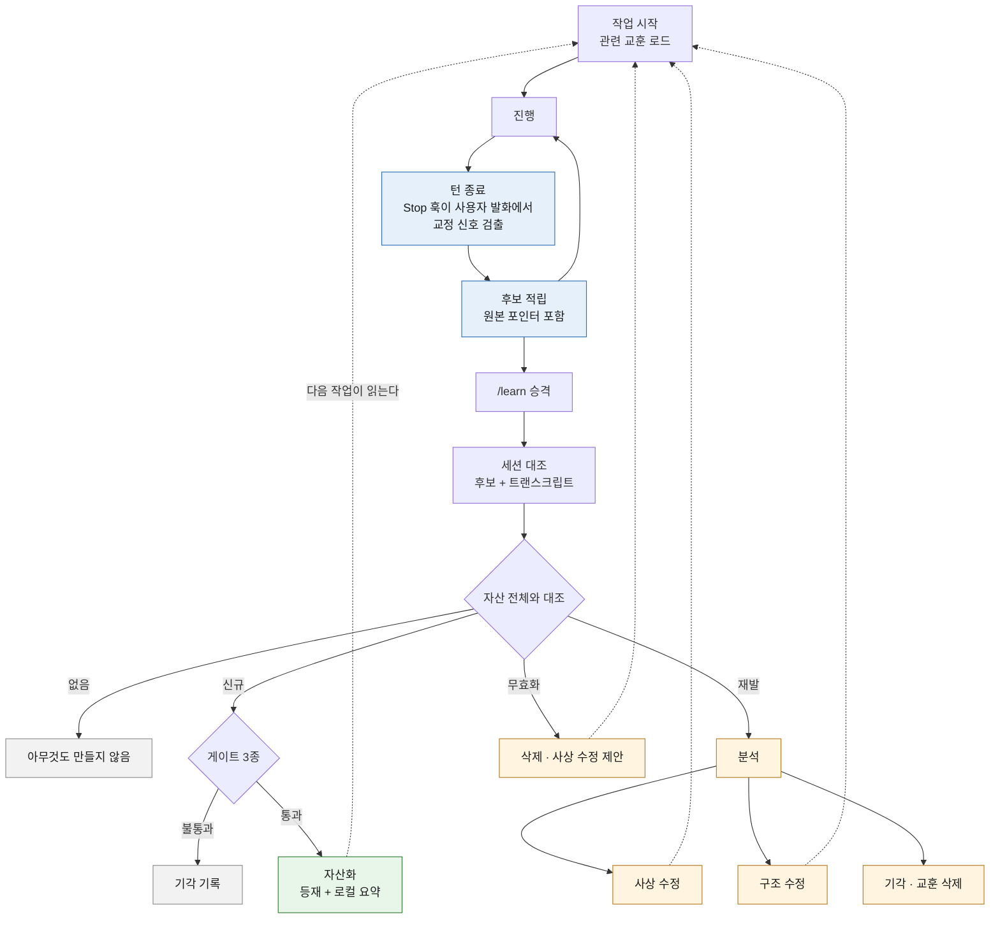

# 교훈 자산화

작업에서 나온 교훈을 다음 작업이 읽는 자산으로 남기는 절차다. 규약과 판정 기준만 이 레포에 두고 실제 교훈은 소비 프로젝트가 자기 스코프에 채운다. 배치는 [PARA 스켈레톤](../templates/para/README.md)의 `areas` 를 쓴다.

## 왜 필요한가

교정은 대화 안에서 소비되고 사라진다. 같은 유형의 오판이 다시 나오면 사람이 다시 잡아야 하고 놓치면 그대로 지나간다. 규칙을 늘려도 이 구조는 바뀌지 않는다. 규칙을 추가하는 주체가 사람이면 사람이 알아차린 것만 규칙이 된다.

## 용어

셋만 쓴다.

| 용어 | 뜻 |
|------|-----|
| **교훈** | 작업에서 얻은 재사용 가능한 판단. 파일 하나 = 교훈 하나 |
| **자산화** | 교훈을 `areas` 에 등재하고 인덱스를 갱신 |
| **분석** | 재발했을 때 하는 것. 자산이 있었는데 왜 작동하지 않았는지 캔다 |

## 절차

수집을 작업 완료 단계에 두면 두 곳에서 새어 나간다. 완료에 도달하지 못한 작업은 통째로 빠지고, 진행 중 기록을 에이전트 자발성에 맡기면 놓친 것이 기록되지 않는다. **놓친 것이 교훈 대상이므로 그 구조는 성립하지 않는다.** 그래서 검출은 턴마다 훅이 하고, 판단은 승격 시점 한 곳에 모은다.

교정이 0건이면 아무것도 만들지 않는다. 교정이 없던 작업에 빈 교훈을 쌓으면 자산 총량만 늘고 신호가 묻힌다.

**후보 0건과 교정 0건은 다르다.** 훅이 아무것도 적립하지 않아도 승격은 세션을 읽는다. 검출 패턴은 부정어 중심이라 지시형·질문형 교정을 놓치는데, 후보만 보면 그 교정에 걸린 재발까지 함께 사라진다.

이슈 완료 단계에도 수집이 남아 있다. 이슈 단위로 마무리할 때 그 기간을 훑는 용도이고, 주 경로는 턴 종료 훅이다.

### 기계가 하는 것과 하지 않는 것

| 단계 | 주체 |
|------|------|
| 교정 신호 검출·후보 적립 | 훅 (턴마다) |
| 세션에서 교정 추리기 | 에이전트 |
| 자산 전체와 대조 (신규·재발·무효화) | 에이전트 |
| 원인 판정·결론 | 에이전트, 근거 제시 |
| 등재·교훈 삭제·사상 수정 | 사람 승인 |

대조는 의미 비교라 기계가 못 한다. 훅은 후보를 내밀고 판정은 넘긴다.

### 검출은 재현율 쪽으로 닫는다

차단 가드는 오탐이 비싸다. 정상 작업이 막히는 경험이 쌓이면 사람이 가드를 끄고, 그러면 강제 수준이 0 이 된다. 그래서 대외비 가드의 경계 판정은 차단 쪽으로 닫는다.

후보 적립은 반대다. 오탐이 하나 늘어도 승격 단계에서 걸러지고 작업을 막지 않는다. 반면 미탐은 교훈 자체를 잃는다. 그래서 신호는 넓게 잡고 판정을 뒤로 미룬다.

이 레포의 실제 세션 하나로 측정했다. 고유 사용자 발화 40건 중 14건을 검출했고, 검출된 14건은 모두 교정 성격이었다. 미검출 중 교정으로 판단되는 것은 2건이다.

| 미검출 유형 | 예 | 왜 잡지 않는가 |
|-------------|-----|----------------|
| 한 글자 부정 표기 | "플라이웨이 X" | 단일 문자 패턴은 영문 식별자에 대량 오탐 |
| 지시형 교정 | "실측하세요" | 일반 지시와 구분되지 않아 통상 작업 지시가 모두 유입된다 |

교정 발화를 16건으로 보면 검출률은 14/16 이다. 라벨링은 사람 판정이므로 이 값은 추정이고, 세션 하나 표본이다.

## 교훈 파일 규약

한 파일에 한 교훈. 발생 이력을 누적해 **재발 횟수가 파일 안에서 보이게** 한다. 별도 집계 파일을 두면 두 곳이 어긋난다.

| 항목 | 내용 |
|------|------|
| 증상 | 무엇을 잘못했는가. 결과가 아니라 행위 |
| 원인 | 아래 원인 목록 중 하나 |
| 조치 | 무엇을 바꿨는가. 어느 파일·어느 규칙인지까지 |
| 원천 | 답이 이미 있었다면 그 위치 |
| 발생 이력 | 작업 식별자와 날짜. 목록 길이가 재발 횟수 |
| **원본 포인터** | 세션과 트랜스크립트 경로. 요약만 남기지 않는다 |

프론트매터 필드 이름과 버킷 경로는 소비 프로젝트가 정한다. 이미 자산 규약을 가진 프로젝트가 그것을 두 벌 갖게 하지 않는다.

원본 포인터가 필수인 이유는 요약이 신호를 잃기 때문이다. 검색 스킬 자기개선 실험의 ablation 에서 원본 트레이스를 받은 개선 제안자가 요약본을 받은 쪽보다 뚜렷하게 나았고, 요약본은 잃은 신호를 복구하지 못했다. 교훈은 요약이므로 되짚을 경로를 함께 남긴다.

## 승격 게이트

훅은 후보 적립까지만 한다. 등재는 게이트를 통과한 것만 한다.

| 게이트 | 판정 |
|--------|------|
| 사실 확인 | 원천이 실제로 그 파일·그 위치에 있는가. **그 원천이 최신 사실과 맞는가** |
| 모순 확인 | 기존 교훈과 충돌하지 않는가 |
| 일반화 확인 | 한 번의 변동을 규칙으로 굳히는 건 아닌가 |

자동 등재를 하지 않는 이유는 검증 없는 자기 학습 루프의 보고된 결과다. 자율 학습 루프의 데이터 품질 분석에서 검증 장치가 없을 때 helpfulness 하락과 model collapse 징후가 나타났다. 자동 캡처를 켜면서 검증을 붙이지 않으면 노이즈가 자산이 된다.

두 번째 게이트에 "원천이 최신 사실과 맞는가" 가 붙은 것은 실제 재발 때문이다. 원천 문서를 열어도 그 문서가 작성 시점 판단을 확인 없이 옮겨 적은 것이면 같은 오판이 나온다. 문서에 적힌 판단은 그때의 것이다.

등재와 로컬 인덱스 요약은 **한 동작**이다. 원격에만 등재하면 다음 판단 시점에 닿지 않는다. 등재 직후 같은 오판이 재발한 사례가 이것을 확인했다.

## 무효화

게이트의 사실 확인은 등재 시점 한 번만 걸린다. 그 뒤로 자산은 다시 검사받지 않는데, 자산이 가리키는 코드·플래그·경로는 계속 움직인다.

**낡은 자산은 없는 것보다 나쁘다.** 자산이 있으면 그것이 확인을 대신하기 때문이다. 값이 틀렸으면 확인을 건너뛴 채로 틀린다. 자산을 늘리는 절차만 있고 줄이는 절차가 없으면 총량이 단조 증가한다. 원인 목록의 "신호가 묻혔다" 가 그 끝이다.

그래서 승격 판정에서 자산을 대조할 때 **지금도 사실인가**를 함께 본다. 별도 주기를 두지 않는 이유는 주기 작업이 밀리기 때문이다. 이미 그 자산을 읽는 자리에서 같이 판정한다.

| 신호 | 결론 |
|------|------|
| 자산이 가리키는 대상이 사라졌다 | 삭제 |
| 근거는 남았으나 결론이 달라졌다 | 사상 수정 |
| 특정 버전·환경에서만 성립하게 됐다 | 적용 범위를 자산에 적는다 |

삭제와 수정도 등재와 같이 사람 승인을 거친다. 판정자가 바로 지우지 않는다.

## 재발 분석

자산이 있는데도 재발했다면 교훈이 아니라 **교훈을 전달하는 구조**를 의심한다. 원인은 이 중 하나다.

| 원인 | 확인 방법 |
|------|-----------|
| 로드되지 않았다 | 주입 시점과 판단 시점의 거리 |
| 찾지 못했다 | 인덱스 서술이 실제 검색어와 맞는가 |
| 읽었으나 적용 시점을 놓쳤다 | 읽는 지점과 판단 지점이 같은가 |
| 기록이 틀렸다 | 교훈 자체의 사실 확인 |
| 신호가 묻혔다 | 자산 총량과 로드 예산 |
| 규칙끼리 충돌해 다른 쪽이 이겼다 | 충돌 쌍 실측 |
| 문제가 아니었다 | 한 번의 변동을 규칙으로 굳혔는가 |

결론은 셋 중 하나로 낸다.

| 결론 | 뜻 |
|------|-----|
| **사상 수정** | 교훈 또는 그 상위 전제가 틀렸다. 고쳐 쓴다 |
| **구조 수정** | 판단은 맞았고 전달 경로가 틀렸다. 로드·인덱스·순서를 고친다 |
| **기각** | 문제가 아니었다. 교훈을 삭제한다 |

조사 범위는 스킬·훅·provider·규칙 문서 전체다. 같은 유형의 오판이 다른 곳에 잠재해 있는지 봐야 하므로 대상을 손으로 열거하지 않는다. 컨텍스트 비용이 크기 때문에 서브에이전트에 위임하고 결론만 받는다 ([위임 상한](../CLAUDE.md#서브-에이전트-위임-상한)).

## 가드를 자동으로 늘리지 않는다

재발했을 때 차단 규칙을 추가하는 것이 가장 빠른 조치다. 그것을 기본 경로에서 뺐다.

- 가드는 증상 하나를 덮는다. 원인이 남아 있으면 다음 증상이 다른 자리에서 나온다
- 가드가 늘면 가드끼리 충돌한다. 원인 목록에 "규칙끼리 충돌해 다른 쪽이 이겼다" 가 있는 이유다
- 오탐이 쌓이면 사람이 가드를 끈다. 그러면 강제 수준이 0 이 된다

가드는 분석 결과로만 추가한다. 분석 없이 추가하는 가드는 임시 조치이고 임시 조치의 누적은 되돌리기 어렵다.

## 지표

기간별로 뽑는다. 이 절차가 스스로 틀렸는지 보는 수단이다.

| 지표 | 무엇을 뜻하는가 | 값 |
|------|-----------------|-----|
| 검출률 | 훅이 교정을 얼마나 잡는가. 낮으면 판정이 세션 대조에 의존한다 | 미측정 |
| 자산화 후 다음 재발까지 걸린 작업 수 | 자산이 실제로 작동하는가 | 미측정 |
| 교훈 건수 · 재발 건수 | 규모 | 미측정 |
| 후보 대비 승격률 | 낮으면 신호가 노이즈만 만들고 있다 | 미측정 |
| 기각률 | 높으면 규칙을 과잉 생성하고 있다 | 미측정 |
| 사상 수정 대 구조 수정 비율 | 사상 수정이 계속 나오면 상위 전제가 흔들린다 | 미측정 |
| 가드 증가 대비 재발 감소 | 늘려도 안 줄면 가드가 임시 조치라는 증거 | 미측정 |

값은 비워 둔다. 이 레포는 측정하지 않은 주장을 적지 않는다. 기각률이 이 절차의 자기 점검 지점이다. 교훈이 많이 기각된다면 문제를 잡는 게 아니라 변동을 규칙으로 굳히고 있다는 뜻이다.

### 앞의 둘은 측정 방법을 고정한다

나머지는 정의만 두고 방법을 열어 두지만, 이 둘은 개선 전후를 같은 자로 재야 하므로 산출을 고정한다.

| 지표 | 산출 | 어디서 | 언제 |
|------|------|--------|------|
| 검출률 | 훅이 적립한 후보 수 ÷ 세션 대조로 교정이라 판정된 발화 수 | 승격 판정 결과 | 판정 직후 |
| 자산화 후 다음 재발까지 걸린 작업 수 | 자산의 `발생 이력` 두 항목 사이에 완료된 작업 수 | 자산 파일 | 재발 판정 시 |

검출률의 분모는 훅만으로 셀 수 없어 승격 시점에야 나온다. 이 값이 낮다고 훅을 고치는 결론으로 바로 가지 않는다. 신호를 넓히면 오탐이 늘어 승격 부담이 커진다. 판정이 세션 대조에 얼마나 기대고 있는지를 보는 눈금이다.

재발이 아직 없는 자산은 등재 이후 완료 작업 수를 하한으로 적는다. 날짜 간격이 아니라 작업 수로 세는 이유는 쉬는 기간이 값을 부풀리기 때문이다.

## 경계

| 이 레포 | 소비 프로젝트 |
|---------|---------------|
| 용어·절차·파일 규약 | 실제 교훈 |
| 원인 목록·결론 종류 | 버킷 경로·프론트매터 이름 |
| 지표 정의 | 지표 값 |
| 검출 시점·신호 기본 규칙 | 신호 로컬 확장·인덱스 갱신 |

교훈에는 판단만 담고 자격·식별자는 담지 않는다. 자산은 오래 남고 열람 범위가 넓어진다.
