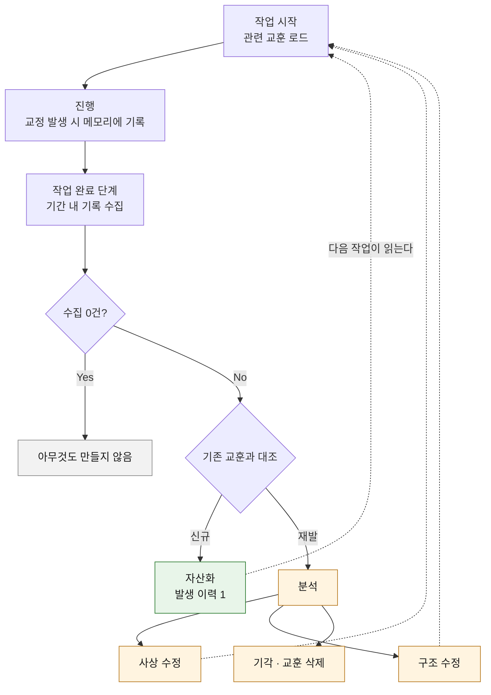

# 교훈 자산화

작업에서 나온 교훈을 다음 작업이 읽는 자산으로 남기는 절차다. 규약과 판정 기준만 이 레포에 두고 실제 교훈은 소비 프로젝트가 자기 스코프에 채운다. 배치는 [PARA 스켈레톤](../templates/para/README.md)의 `areas` 를 쓴다.

## 왜 필요한가

교정은 대화 안에서 소비되고 사라진다. 같은 유형의 오판이 다시 나오면 사람이 다시 잡아야 하고 놓치면 그대로 지나간다. 규칙을 늘려도 이 구조는 바뀌지 않는다. 규칙을 추가하는 주체가 사람이면 사람이 알아차린 것만 규칙이 된다.

## 용어

셋만 쓴다.

| 용어 | 뜻 |
|------|-----|
| **교훈** | 작업에서 얻은 재사용 가능한 판단. 파일 하나 = 교훈 하나 |
| **자산화** | 교훈을 `areas` 에 등재하고 인덱스를 갱신 |
| **분석** | 재발했을 때 하는 것. 자산이 있었는데 왜 작동하지 않았는지 캔다 |

## 절차

진행 중에는 기록만 하고 판단은 완료 시점 한 곳에 모은다. 작업 흐름에 붙는 비용이 없어야 절차가 살아남는다.

수집 0건이면 아무것도 만들지 않는다. 교정이 없던 작업에 빈 교훈을 쌓으면 자산 총량만 늘고 신호가 묻힌다.

### 기계가 하는 것과 하지 않는 것

| 단계 | 주체 |
|------|------|
| 기간 내 기록 수집 | 훅 |
| 기존 교훈과 대조 (같은 교훈의 재발인가) | 에이전트 |
| 원인 판정·결론 | 에이전트, 근거 제시 |
| 교훈 삭제·사상 수정 | 사람 승인 |

대조는 의미 비교라 기계가 못 한다. 훅은 후보를 내밀고 판정은 넘긴다.

## 교훈 파일 규약

한 파일에 한 교훈. 발생 이력을 누적해 **재발 횟수가 파일 안에서 보이게** 한다. 별도 집계 파일을 두면 두 곳이 어긋난다.

| 항목 | 내용 |
|------|------|
| 증상 | 무엇을 잘못했는가. 결과가 아니라 행위 |
| 원인 | 아래 원인 목록 중 하나 |
| 조치 | 무엇을 바꿨는가. 어느 파일·어느 규칙인지까지 |
| 원천 | 답이 이미 있었다면 그 위치 |
| 발생 이력 | 작업 식별자와 날짜. 목록 길이가 재발 횟수 |

프론트매터 필드 이름과 버킷 경로는 소비 프로젝트가 정한다. 이미 자산 규약을 가진 프로젝트가 그것을 두 벌 갖게 하지 않는다.

## 재발 분석

자산이 있는데도 재발했다면 교훈이 아니라 **교훈을 전달하는 구조**를 의심한다. 원인은 이 중 하나다.

| 원인 | 확인 방법 |
|------|-----------|
| 로드되지 않았다 | 주입 시점과 판단 시점의 거리 |
| 찾지 못했다 | 인덱스 서술이 실제 검색어와 맞는가 |
| 읽었으나 적용 시점을 놓쳤다 | 읽는 지점과 판단 지점이 같은가 |
| 기록이 틀렸다 | 교훈 자체의 사실 확인 |
| 신호가 묻혔다 | 자산 총량과 로드 예산 |
| 규칙끼리 충돌해 다른 쪽이 이겼다 | 충돌 쌍 실측 |
| 문제가 아니었다 | 한 번의 변동을 규칙으로 굳혔는가 |

결론은 셋 중 하나로 낸다.

| 결론 | 뜻 |
|------|-----|
| **사상 수정** | 교훈 또는 그 상위 전제가 틀렸다. 고쳐 쓴다 |
| **구조 수정** | 판단은 맞았고 전달 경로가 틀렸다. 로드·인덱스·순서를 고친다 |
| **기각** | 문제가 아니었다. 교훈을 삭제한다 |

조사 범위는 스킬·훅·provider·규칙 문서 전체다. 같은 유형의 오판이 다른 곳에 잠재해 있는지 봐야 하므로 대상을 손으로 열거하지 않는다. 컨텍스트 비용이 크기 때문에 서브에이전트에 위임하고 결론만 받는다 ([위임 상한](../CLAUDE.md#서브-에이전트-위임-상한)).

## 가드를 자동으로 늘리지 않는다

재발했을 때 차단 규칙을 추가하는 것이 가장 빠른 조치다. 그것을 기본 경로에서 뺐다.

- 가드는 증상 하나를 덮는다. 원인이 남아 있으면 다음 증상이 다른 자리에서 나온다
- 가드가 늘면 가드끼리 충돌한다. 원인 목록에 "규칙끼리 충돌해 다른 쪽이 이겼다" 가 있는 이유다
- 오탐이 쌓이면 사람이 가드를 끈다. 그러면 강제 수준이 0 이 된다

가드는 분석 결과로만 추가한다. 분석 없이 추가하는 가드는 임시 조치이고 임시 조치의 누적은 되돌리기 어렵다.

## 지표

기간별로 뽑는다. 이 절차가 스스로 틀렸는지 보는 수단이다.

| 지표 | 무엇을 뜻하는가 | 값 |
|------|-----------------|-----|
| 교훈 건수 · 재발 건수 | 규모 | 미측정 |
| 기각률 | 높으면 규칙을 과잉 생성하고 있다 | 미측정 |
| 사상 수정 대 구조 수정 비율 | 사상 수정이 계속 나오면 상위 전제가 흔들린다 | 미측정 |
| 자산화 후 다음 재발까지 걸린 작업 수 | 자산이 실제로 작동하는가 | 미측정 |
| 가드 증가 대비 재발 감소 | 늘려도 안 줄면 가드가 임시 조치라는 증거 | 미측정 |

값은 비워 둔다. 이 레포는 측정하지 않은 주장을 적지 않는다. 기각률이 이 절차의 자기 점검 지점이다. 교훈이 많이 기각된다면 문제를 잡는 게 아니라 변동을 규칙으로 굳히고 있다는 뜻이다.

## 경계

| 이 레포 | 소비 프로젝트 |
|---------|---------------|
| 용어·절차·파일 규약 | 실제 교훈 |
| 원인 목록·결론 종류 | 버킷 경로·프론트매터 이름 |
| 지표 정의 | 지표 값 |
| 수집 시점 (완료 단계) | 수집 구현·인덱스 갱신 |

교훈에는 판단만 담고 자격·식별자는 담지 않는다. 자산은 오래 남고 열람 범위가 넓어진다.
